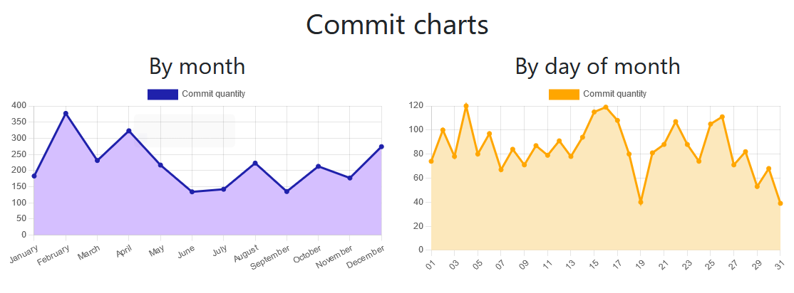
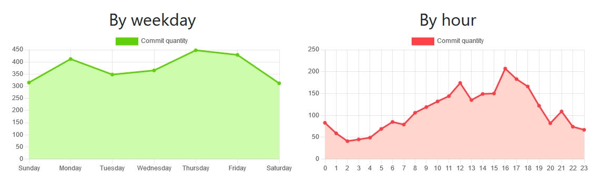

# Git Analytics

Prototype for a simple dashboard for displaying commit data from GitLab, allowing personal evaluation.




---

## Usage:
1. Open gitlab/dataload.js and change this variables to your user:
```javascript
const user = "doctormo";
```
2. Open gitlab/dataload.html in a browser. Wait for script execution. Save result file as "dataset.js" in root directory.
3. Open index.html to see your data displayed.

---

## Next steps:
- Add a way to filter Git data.
- Structure dataset and server side data collection.
- Add pages to show quantity of changed, added and deleted lines.
- Add statistics and insights page.
- On 'By hour' graph, add weekday filter.
- On 'By day of month' graph, add month filter.
